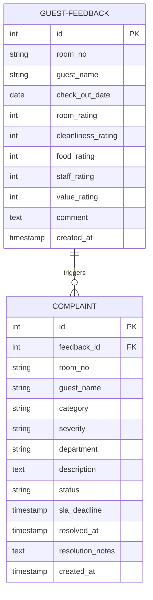

# RK Suites Hotel Guest Feedback & Complaint Resolution System
## Comprehensive Project Documentation

---

## 1. Company Profile & Project Background
**RK Suites** is a premium hotel property located in Hyderabad, offering comfortable accommodations for business and leisure travellers. The hotel features Standard and Superior room categories, an in-house restaurant, and modern conference facilities.

In the hospitality industry, guest satisfaction ratings on Google, TripAdvisor, and Online Travel Agencies (OTAs) directly impact hotel occupancy and revenue. Currently, RK Suites relies on manual comment cards and verbal feedback at checkout. This project aims to digitize this process, creating a live feedback loop that intercepts issues immediately, automates departmental routing, tracks resolutions via SLAs, and provides weekly reports to the General Manager.

---

## 2. Problem Statement & Abstract

### Problem Statement
RK Suites suffers from a low completion rate (< 10%) on physical comment cards. Verbal complaints made during check-out are logged on paper registers, which are reviewed by the GM only once a week—long after the guest has departed. There is no structured categorization of complaints, making department-level patterns (like repeated housekeeping delays or F&B quality issues) invisible. Additionally, the lack of defined Service Level Agreements (SLAs) means some critical issues remain unresolved for days. Consequently, unresolved guest friction regularly translates into negative public reviews on TripAdvisor and Google.

### Abstract
The **Hotel Guest Feedback & Complaint Resolution System** digitizes checkout feedback via a simple, mobile-friendly QR form. Guests grade their stay across 5 core categories: Room Quality, Cleanliness, Food, Staff Behavior, and Value for Money. 
If any category rating drops to $\le 2$ (poor), the system automatically flags a complaint, tags it with a severity rating (Critical, Major, Minor), routes it to the responsible department (Housekeeping, Maintenance, F&B, Front Desk), and starts a real-time SLA countdown timer. If a complaint is not resolved within the SLA window, the system escalates the issue to the General Manager. The hotel dashboard displays active SLA timelines, live status updates, and compiles weekly analytics to target and fix recurring operational bottlenecks.

---

## 3. Project Objectives
1. **Digitize Feedback Collection**: Replace physical comment cards with a QR-based checkout form, increasing feedback submission rates from < 10% to > 50%.
2. **Automate Complaint Flagging**: Automatically identify sub-standard ratings ($\le 2$ stars) and route them to department heads without manual front-desk delay.
3. **Enforce Service Level Agreements (SLAs)**: Implement SLA timers (Critical = 1h, Major = 4h, Minor = 24h) to ensure rapid operational resolution.
4. **Enable Manager Escalate Controls**: Automatically escalate unresolved complaints to management once SLA deadlines are breached.
5. **Generate Weekly Operational Reports**: Aggregate feedback trends, SLA compliance rates, and department response times to drive data-driven staffing and training decisions.

---

## 4. System Architecture & Database Design



---

## 5. API Endpoints Specification

### 1. Guest Feedback Routes
* **POST `/api/guest_feedback`**
  * *Description*: Submit checkout feedback.
  * *Request Body*:
    ```json
    {
      "room_no": "204",
      "guest_name": "Aditya Rao",
      "room_rating": 2,
      "cleanliness_rating": 5,
      "food_rating": 5,
      "staff_rating": 4,
      "value_rating": 4,
      "comment": "AC was making loud noises."
    }
    ```
  * *Response (201 Created)*:
    ```json
    {
      "success": true,
      "feedback": { "id": 12, "room_no": "204", ... },
      "complaintsCreatedCount": 1,
      "complaints": [
        {
          "id": 8,
          "feedback_id": 12,
          "category": "Room Quality",
          "severity": "Major",
          "department": "Maintenance",
          "status": "Pending",
          "sla_deadline": "2026-06-06T18:03:12.000Z"
        }
      ]
    }
    ```

* **GET `/api/guest_feedback`**
  * *Description*: Retrieve all guest feedbacks.

---

### 2. Complaint Tracking Routes
* **GET `/api/complaints`**
  * *Description*: Fetch all complaints. Optional query parameters: `status`, `department`, `severity`.
* **PATCH `/api/complaints/:id`**
  * *Description*: Update status, department, severity, or resolution notes.
  * *Request Body*:
    ```json
    {
      "status": "Resolved",
      "resolution_notes": "Electrician tightened casing screws on the wall-mounted AC unit."
    }
    ```

---

### 3. Weekly Reports Routes
* **GET `/api/reports/weekly`**
  * *Description*: Generate weekly aggregates of guest satisfaction ratings, SLA compliance percentages, and department-wise metrics.
